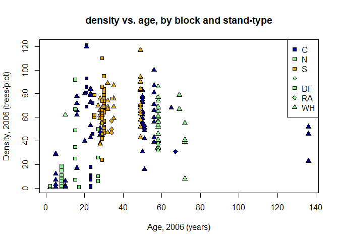
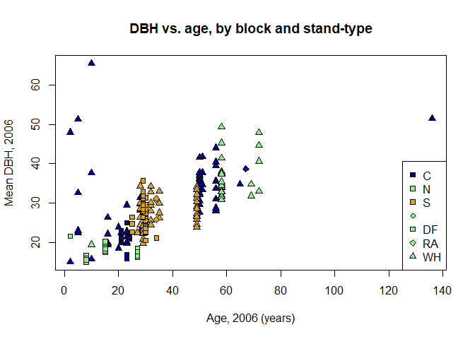
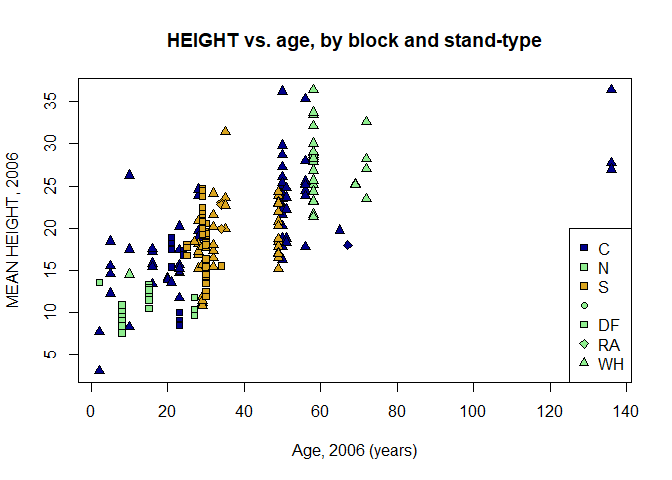
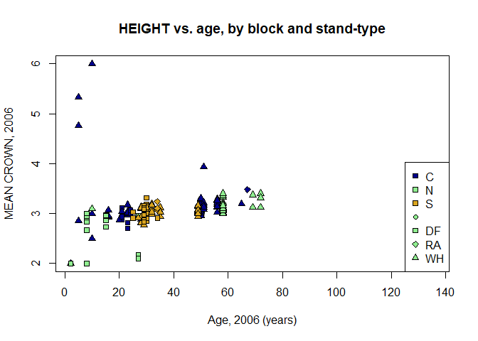

Ellsworth Resurvey Data Analysis
================

## Goals and Approach

The primary goal of these preliminary analyses is to figure out how many
plots should be resurveyed at Ellsowrth in summe, echo=TRUE,
results=“hide”r 2020. To do this, we used the pre-treatment survey
data from 2006/2007 to quantify variance in density, height, and DBH of
plots by block and stand type.

## Summary

## Data Files

We used the following datafiles, which can be in the Ellsworth GitHub
repo (<https://github.com/AileneKane/ellsworth>) as well as in the
“Ellsworth Science and Monitoring” shared folder on Box.

LIVETREES\_CLEAN\_04282008.csv

PLOT\_CLEAN\_11062008.csv

Ellsworth\_stands\_treatment\_data.csv

## Analysis of pre-treatment survey data

We load the above files and packages, and then put them together into a
dataframe for analysis

There is some structure to the data, that may be important to account
for in looking at treatment effects, and therefore should be kept in
mind in resurveys: -Blocks (N,C,S), which are different geographical
regions at Ellsworth -Standtype, which are different forest types at
Ellsworth. Here is a breakdown of the number of plots in each standtype
by region:

``` r
 table(plotd2$STAND.TYP,plotd2$BLOCK)
```

    ##             
    ##               C  N  S
    ##               0  2  3
    ##   DF-1        6 21  0
    ##   DF-2        7  4 40
    ##   RA-3        1  0  4
    ##   WH/SS/RC-1 15  1  0
    ##   WH/SS/RC-2 19  0 19
    ##   WH/SS/RC-3 33  3 18
    ##   WH/SS/RC-4  0 25  0
    ##   WH/SS/RC-5  3  0  0

Now lets look at effects of age on density, height, dbh, and crown, and
quantify variation by region and stand-type using multilevel models.

## Density

``` r
colors<-c("darkblue","lightgreen","goldenrod")
symbs<-c(21,22,23,24)
blocks<-as.character(unique(plotd2$BLOCK))
treats<-unique(plotd2$TRT)
sttypes<-sort(unique(plotd2$stand.code))

plot(plotd2$AGE_BH_2006,plotd2$predens, pch=symbs[as.numeric(as.factor(plotd2$stand.code))], bg=colors[as.numeric(as.factor(plotd2$BLOCK))], xlab="Age, 2006 (years)", ylab= "Density, 2006 (trees/plot)", main="density vs. age, by block and stand-type")

legend("topright", legend=c(blocks,sttypes),pch=c(22,22,22,symbs),pt.bg=c(colors,"lightgreen","lightgreen","lightgreen","lightgreen") )
```

<!-- -->

``` r
densmod<-lmer(predens~AGE_BH_2006 + (1|BLOCK)  + (1|STAND.TYPE), data=plotd2)

den.standsd<-VarCorr(densmod,comp="Variance")[1]
den.blocksd<-VarCorr(densmod,comp="Variance")[2]
Bage.dens<-fixef(densmod)[2]
int.dens<-fixef(densmod)[1]
summary(densmod)#
```

    ## Linear mixed model fit by REML ['lmerMod']
    ## Formula: predens ~ AGE_BH_2006 + (1 | BLOCK) + (1 | STAND.TYPE)
    ##    Data: plotd2
    ## 
    ## REML criterion at convergence: 1910.6
    ## 
    ## Scaled residuals: 
    ##     Min      1Q  Median      3Q     Max 
    ## -2.5567 -0.5631 -0.1083  0.5731  3.9016 
    ## 
    ## Random effects:
    ##  Groups     Name        Variance Std.Dev.
    ##  STAND.TYPE (Intercept) 500.57   22.373  
    ##  BLOCK      (Intercept)  36.66    6.055  
    ##  Residual               365.33   19.114  
    ## Number of obs: 216, groups:  STAND.TYPE, 8; BLOCK, 3
    ## 
    ## Fixed effects:
    ##             Estimate Std. Error t value
    ## (Intercept) 49.43120   11.43900   4.321
    ## AGE_BH_2006 -0.09828    0.16634  -0.591
    ## 
    ## Correlation of Fixed Effects:
    ##             (Intr)
    ## AGE_BH_2006 -0.629

There is a weak negative effect of age on density, after accounting for
variation in density and blocks. There is much higher variance in
density by stand type than by block.

## DBH

``` r
plot(plotd2$AGE_BH_2006,plotd2$dbh.mn, pch=symbs[as.numeric(as.factor(plotd2$stand.code))], bg=colors[as.numeric(as.factor(plotd2$BLOCK))], xlab="Age, 2006 (years)", ylab= "Mean DBH, 2006", main="DBH vs. age, by block and stand-type")

legend("bottomright", legend=c(blocks,sttypes),pch=c(22,22,22,symbs),pt.bg=c(colors,"lightgreen","lightgreen","lightgreen","lightgreen") )
```

<!-- -->

``` r
dbhmod<-lmer(DBH~ AGE_BH_2006+(1|BLOCK) + (1|STAND.TYPE), data=treed2)
dbh.standsd<-VarCorr(dbhmod,comp="Variance")[1]
dbh.blocksd<-VarCorr(dbhmod,comp="Variance")[2]
summary(dbhmod)#positive effect of age on dbh, similar variance by TRT and Block
```

    ## Linear mixed model fit by REML ['lmerMod']
    ## Formula: DBH ~ AGE_BH_2006 + (1 | BLOCK) + (1 | STAND.TYPE)
    ##    Data: treed2
    ## 
    ## REML criterion at convergence: 84818.7
    ## 
    ## Scaled residuals: 
    ##     Min      1Q  Median      3Q     Max 
    ## -2.5699 -0.6381 -0.1143  0.4534 15.3875 
    ## 
    ## Random effects:
    ##  Groups     Name        Variance  Std.Dev.
    ##  STAND.TYPE (Intercept)  54.12234  7.3568 
    ##  BLOCK      (Intercept)   0.03443  0.1855 
    ##  Residual               101.59504 10.0794 
    ## Number of obs: 11365, groups:  STAND.TYPE, 8; BLOCK, 3
    ## 
    ## Fixed effects:
    ##             Estimate Std. Error t value
    ## (Intercept) 14.13399    2.73878   5.161
    ## AGE_BH_2006  0.32242    0.01829  17.627
    ## 
    ## Correlation of Fixed Effects:
    ##             (Intr)
    ## AGE_BH_2006 -0.302

There is a positive effect of age on dbh, after accounting for variation
in density and blocks. There is much higher variance in dbh by stand
type than by block.

## Height

``` r
plot(plotd2$AGE_BH_2006,plotd2$ht.mn, pch=symbs[as.numeric(as.factor(plotd2$stand.code))], bg=colors[as.numeric(as.factor(plotd2$BLOCK))], xlab="Age, 2006 (years)", ylab= "MEAN HEIGHT, 2006", main="HEIGHT vs. age, by block and stand-type")

legend("bottomright", legend=c(blocks,sttypes),pch=c(22,22,22,symbs),pt.bg=c(colors,"lightgreen","lightgreen","lightgreen","lightgreen") )
```

<!-- -->

``` r
htmod<-lmer(HT~ AGE_BH_2006+(1|BLOCK) + (1|STAND.TYPE), data=treed2)
summary(htmod)#positive effect of age on ht, higher variance by TRT...
```

    ## Linear mixed model fit by REML ['lmerMod']
    ## Formula: HT ~ AGE_BH_2006 + (1 | BLOCK) + (1 | STAND.TYPE)
    ##    Data: treed2
    ## 
    ## REML criterion at convergence: 14022.2
    ## 
    ## Scaled residuals: 
    ##     Min      1Q  Median      3Q     Max 
    ## -3.3668 -0.6304 -0.0418  0.5464  4.9806 
    ## 
    ## Random effects:
    ##  Groups     Name        Variance Std.Dev.
    ##  STAND.TYPE (Intercept) 21.74663 4.6633  
    ##  BLOCK      (Intercept)  0.08047 0.2837  
    ##  Residual               35.52325 5.9601  
    ## Number of obs: 2182, groups:  STAND.TYPE, 8; BLOCK, 3
    ## 
    ## Fixed effects:
    ##             Estimate Std. Error t value
    ## (Intercept) 17.48581    1.92169   9.099
    ## AGE_BH_2006  0.05838    0.02098   2.782
    ## 
    ## Correlation of Fixed Effects:
    ##             (Intr)
    ## AGE_BH_2006 -0.495

``` r
ht.standsd<-VarCorr(htmod,comp="Variance")[1]
ht.blocksd<-VarCorr(htmod,comp="Variance")[2]
```

There is a positive effect of age on height, after accounting for
variation in density and blocks. There is much higher variance in height
by stand type than by block. \#\# Crown

``` r
plot(plotd2$AGE_BH_2006,plotd2$crown.mn, pch=symbs[as.numeric(as.factor(plotd2$stand.code))], bg=colors[as.numeric(as.factor(plotd2$BLOCK))], xlab="Age, 2006 (years)", ylab= "MEAN CROWN, 2006", main="CROWN vs. age, by block and stand-type")

legend("bottomright", legend=c(blocks,sttypes),pch=c(22,22,22,symbs),pt.bg=c(colors,"lightgreen","lightgreen","lightgreen","lightgreen"))
```

<!-- -->

``` r
crownmod<-lmer(CROWN~ AGE_BH_2006+(1|BLOCK) + (1|STAND.TYPE), data=treed2)

summary(crownmod)#positive effect of age on crown, lsightly higher variance in TRt than block
```

    ## Linear mixed model fit by REML ['lmerMod']
    ## Formula: CROWN ~ AGE_BH_2006 + (1 | BLOCK) + (1 | STAND.TYPE)
    ##    Data: treed2
    ## 
    ## REML criterion at convergence: 16545.3
    ## 
    ## Scaled residuals: 
    ##     Min      1Q  Median      3Q     Max 
    ## -5.6792 -0.2866 -0.0561 -0.0175  5.7064 
    ## 
    ## Random effects:
    ##  Groups     Name        Variance Std.Dev.
    ##  STAND.TYPE (Intercept) 0.16535  0.4066  
    ##  BLOCK      (Intercept) 0.01763  0.1328  
    ##  Residual               0.24948  0.4995  
    ## Number of obs: 11366, groups:  STAND.TYPE, 8; BLOCK, 3
    ## 
    ## Fixed effects:
    ##             Estimate Std. Error t value
    ## (Intercept) 2.859453   0.168422  16.978
    ## AGE_BH_2006 0.006614   0.000916   7.221
    ## 
    ## Correlation of Fixed Effects:
    ##             (Intr)
    ## AGE_BH_2006 -0.246

``` r
crown.standsd<-VarCorr(crownmod,comp="Variance")[1]
crown.blocksd<-VarCorr(crownmod,comp="Variance")[2]
```

There is a positive effect of age on crown, after accounting for
variation in density and blocks. There is much higher variance in crown
by stand type than by block.

## How many plots do we need to capture treatment effects, amidst all the variation?

To figure out how many plots need to be resampled to capture the
treatment effects, amidst all the variation among blocks and standtypes,
we simulated a dataset of resampled data. To do this, we set expected
effect sizes of treatment

``` r
#4. set expected effect sizes for simulating data
dens.b = 1#effect of pre-density 
age.b = Bage.dens#age effect (older stands have lower post-density? use coef from density model above)
trt.b = -1 #trt is amount removed (0,3 x predens)
sigma.bl =6.055#estimated block-level sigma from 2006 data 
sigma.st =22.37#estimated stand-type sigma from 2006 data 

sigma = .1#
b0 = int.dens# from model above

#use the effect sizes and predictors plus error to generate the y variable

block = x$block
nblock = length(unique(x$block))
nplot = 72

nstand = 3
blockeff = rep(rnorm(nblock, 0, sigma.bl), each = nplot)
standeff = rep(rnorm(nstand, 0, sigma.st), each = nplot)
ploteff = rnorm(nblock*nplot, 0, sigma)

ypred = b0 + dens.b*x$predens.z + age.b*x$age2006.z + trt.b*x$trt.z+ blockeff+ standeff + ploteff

#lmer(ypred ~ predens.z + age2006.z + trt.z+ (1|block)+ (1|stand.code), data=x )


#now lets write a for loop that uses different sample sizes to figure out how many plots are needed to correctly recover the effects
fulldat<-cbind(ypred,x)
nplots<-rep(c(5,10,15,20,25,30,35,40,45), times=10)
allplots<-c()
for(i in 1:length(nplots)){
  subsdatc<-sample_n(fulldat[fulldat$block=="C",], nplots[i])
  subsdatn<-sample_n(fulldat[fulldat$block=="N",], nplots[i])
  subsdats<-sample_n(fulldat[fulldat$block=="S",], nplots[i])
  subsdat<-rbind(subsdatc,subsdatn,subsdats)
  fit<-lmer(ypred ~ predens.z + age2006.z + trt.z+ (1|block)+ (1|stand.code),data=subsdat)
  cis<-confint(fit)
  fit.sum<-c(nplots[i],fixef(fit),cis[3,],cis[4,],cis[5,],cis[6,])
  allplots<-rbind(allplots,fit.sum)
}
```

    ## Computing profile confidence intervals ...
    ## Computing profile confidence intervals ...

    ## Warning in nextpar(mat, cc, i, delta, lowcut, upcut): unexpected decrease in
    ## profile: using minstep
    
    ## Warning in nextpar(mat, cc, i, delta, lowcut, upcut): unexpected decrease in
    ## profile: using minstep
    
    ## Warning in nextpar(mat, cc, i, delta, lowcut, upcut): unexpected decrease in
    ## profile: using minstep
    
    ## Warning in nextpar(mat, cc, i, delta, lowcut, upcut): unexpected decrease in
    ## profile: using minstep
    
    ## Warning in nextpar(mat, cc, i, delta, lowcut, upcut): unexpected decrease in
    ## profile: using minstep
    
    ## Warning in nextpar(mat, cc, i, delta, lowcut, upcut): unexpected decrease in
    ## profile: using minstep
    
    ## Warning in nextpar(mat, cc, i, delta, lowcut, upcut): unexpected decrease in
    ## profile: using minstep
    
    ## Warning in nextpar(mat, cc, i, delta, lowcut, upcut): unexpected decrease in
    ## profile: using minstep
    
    ## Warning in nextpar(mat, cc, i, delta, lowcut, upcut): unexpected decrease in
    ## profile: using minstep
    
    ## Warning in nextpar(mat, cc, i, delta, lowcut, upcut): unexpected decrease in
    ## profile: using minstep
    
    ## Warning in nextpar(mat, cc, i, delta, lowcut, upcut): unexpected decrease in
    ## profile: using minstep
    
    ## Warning in nextpar(mat, cc, i, delta, lowcut, upcut): unexpected decrease in
    ## profile: using minstep
    
    ## Warning in nextpar(mat, cc, i, delta, lowcut, upcut): unexpected decrease in
    ## profile: using minstep
    
    ## Warning in nextpar(mat, cc, i, delta, lowcut, upcut): unexpected decrease in
    ## profile: using minstep
    
    ## Warning in nextpar(mat, cc, i, delta, lowcut, upcut): unexpected decrease in
    ## profile: using minstep

    ## Warning in profile.merMod(object, which = parm, signames = oldNames, ...): non-
    ## monotonic profile for (Intercept)

    ## Warning in confint.thpr(pp, level = level, zeta = zeta): bad spline fit for
    ## (Intercept): falling back to linear interpolation

    ## Warning in checkConv(attr(opt, "derivs"), opt$par, ctrl = control$checkConv, :
    ## Model failed to converge with max|grad| = 0.00487029 (tol = 0.002, component 1)

    ## Computing profile confidence intervals ...
    ## Computing profile confidence intervals ...
    ## Computing profile confidence intervals ...

    ## boundary (singular) fit: see ?isSingular

    ## Computing profile confidence intervals ...
    ## Computing profile confidence intervals ...

    ## boundary (singular) fit: see ?isSingular

    ## Computing profile confidence intervals ...
    ## Computing profile confidence intervals ...

    ## boundary (singular) fit: see ?isSingular

    ## Computing profile confidence intervals ...
    ## Computing profile confidence intervals ...

    ## boundary (singular) fit: see ?isSingular

    ## Computing profile confidence intervals ...

    ## boundary (singular) fit: see ?isSingular

    ## Computing profile confidence intervals ...
    ## Computing profile confidence intervals ...

    ## boundary (singular) fit: see ?isSingular

    ## Computing profile confidence intervals ...

    ## Warning in zetafun(np, ns): slightly lower deviances (diff=-1.36424e-12)
    ## detected

    ## Warning in nextpar(mat, cc, i, delta, lowcut, upcut): Last two rows have
    ## identical or NA .zeta values: using minstep

    ## Warning in zetafun(np, ns): slightly lower deviances (diff=-5.57066e-12)
    ## detected

    ## Warning in nextpar(mat, cc, i, delta, lowcut, upcut): Last two rows have
    ## identical or NA .zeta values: using minstep

    ## Warning in zetafun(np, ns): slightly lower deviances (diff=-7.27596e-12)
    ## detected

    ## Warning in nextpar(mat, cc, i, delta, lowcut, upcut): Last two rows have
    ## identical or NA .zeta values: using minstep

    ## Warning in zetafun(np, ns): slightly lower deviances (diff=-7.27596e-12)
    ## detected

    ## Warning in FUN(X[[i]], ...): non-monotonic profile for .sig02

    ## Warning in confint.thpr(pp, level = level, zeta = zeta): bad spline fit
    ## for .sig02: falling back to linear interpolation

    ## Warning in regularize.values(x, y, ties, missing(ties)): collapsing to unique
    ## 'x' values

    ## Computing profile confidence intervals ...

    ## Warning in checkConv(attr(opt, "derivs"), opt$par, ctrl = control$checkConv, :
    ## Model failed to converge with max|grad| = 0.00251254 (tol = 0.002, component 1)

    ## Computing profile confidence intervals ...
    ## Computing profile confidence intervals ...

    ## boundary (singular) fit: see ?isSingular

    ## Computing profile confidence intervals ...
    ## Computing profile confidence intervals ...

    ## boundary (singular) fit: see ?isSingular

    ## Computing profile confidence intervals ...
    ## Computing profile confidence intervals ...
    ## Computing profile confidence intervals ...

    ## boundary (singular) fit: see ?isSingular

    ## Computing profile confidence intervals ...

    ## Warning in checkConv(attr(opt, "derivs"), opt$par, ctrl = control$checkConv, :
    ## Model failed to converge with max|grad| = 0.00309077 (tol = 0.002, component 1)

    ## Computing profile confidence intervals ...
    ## Computing profile confidence intervals ...
    ## Computing profile confidence intervals ...

    ## boundary (singular) fit: see ?isSingular

    ## Computing profile confidence intervals ...

    ## Warning in nextpar(mat, cc, i, delta, lowcut, upcut): Last two rows have
    ## identical or NA .zeta values: using minstep

    ## Warning in FUN(X[[i]], ...): non-monotonic profile for .sig02

    ## Warning in confint.thpr(pp, level = level, zeta = zeta): bad spline fit
    ## for .sig02: falling back to linear interpolation

    ## Warning in regularize.values(x, y, ties, missing(ties)): collapsing to unique
    ## 'x' values

    ## boundary (singular) fit: see ?isSingular
    ## Computing profile confidence intervals ...

    ## boundary (singular) fit: see ?isSingular

    ## Computing profile confidence intervals ...

    ## boundary (singular) fit: see ?isSingular

    ## Computing profile confidence intervals ...

    ## boundary (singular) fit: see ?isSingular

    ## Computing profile confidence intervals ...

    ## boundary (singular) fit: see ?isSingular

    ## Computing profile confidence intervals ...

    ## Warning in nextpar(mat, cc, i, delta, lowcut, upcut): Last two rows have
    ## identical or NA .zeta values: using minstep

    ## Warning in FUN(X[[i]], ...): non-monotonic profile for .sig02

    ## Warning in confint.thpr(pp, level = level, zeta = zeta): bad spline fit
    ## for .sig02: falling back to linear interpolation

    ## Warning in regularize.values(x, y, ties, missing(ties)): collapsing to unique
    ## 'x' values

    ## Computing profile confidence intervals ...
    ## Computing profile confidence intervals ...
    ## Computing profile confidence intervals ...

    ## boundary (singular) fit: see ?isSingular

    ## Computing profile confidence intervals ...
    ## Computing profile confidence intervals ...
    ## Computing profile confidence intervals ...

    ## boundary (singular) fit: see ?isSingular

    ## Computing profile confidence intervals ...

    ## boundary (singular) fit: see ?isSingular

    ## Computing profile confidence intervals ...

    ## boundary (singular) fit: see ?isSingular

    ## Computing profile confidence intervals ...

    ## boundary (singular) fit: see ?isSingular

    ## Computing profile confidence intervals ...
    ## Computing profile confidence intervals ...

    ## boundary (singular) fit: see ?isSingular

    ## Computing profile confidence intervals ...

    ## boundary (singular) fit: see ?isSingular

    ## Computing profile confidence intervals ...

    ## boundary (singular) fit: see ?isSingular

    ## Computing profile confidence intervals ...

    ## boundary (singular) fit: see ?isSingular

    ## Computing profile confidence intervals ...

    ## boundary (singular) fit: see ?isSingular

    ## Computing profile confidence intervals ...

    ## boundary (singular) fit: see ?isSingular

    ## Computing profile confidence intervals ...

    ## boundary (singular) fit: see ?isSingular

    ## Computing profile confidence intervals ...

    ## boundary (singular) fit: see ?isSingular

    ## Computing profile confidence intervals ...
    ## Computing profile confidence intervals ...
    ## Computing profile confidence intervals ...

    ## boundary (singular) fit: see ?isSingular

    ## Computing profile confidence intervals ...

    ## boundary (singular) fit: see ?isSingular

    ## Computing profile confidence intervals ...

    ## boundary (singular) fit: see ?isSingular

    ## Computing profile confidence intervals ...
    ## Computing profile confidence intervals ...

    ## Warning in checkConv(attr(opt, "derivs"), opt$par, ctrl = control$checkConv, :
    ## Model failed to converge with max|grad| = 0.00738056 (tol = 0.002, component 1)

    ## Computing profile confidence intervals ...
    ## Computing profile confidence intervals ...

    ## boundary (singular) fit: see ?isSingular

    ## Computing profile confidence intervals ...

    ## Warning in nextpar(mat, cc, i, delta, lowcut, upcut): Last two rows have
    ## identical or NA .zeta values: using minstep

    ## Warning in nextpar(mat, cc, i, delta, lowcut, upcut): Last two rows have
    ## identical or NA .zeta values: using minstep

    ## Warning in zetafun(np, ns): slightly lower deviances (diff=-1.81899e-12)
    ## detected

    ## Warning in nextpar(mat, cc, i, delta, lowcut, upcut): Last two rows have
    ## identical or NA .zeta values: using minstep

    ## Warning in zetafun(np, ns): slightly lower deviances (diff=-1.93268e-12)
    ## detected

    ## Warning in FUN(X[[i]], ...): non-monotonic profile for .sig02

    ## Warning in confint.thpr(pp, level = level, zeta = zeta): bad spline fit
    ## for .sig02: falling back to linear interpolation

    ## Warning in regularize.values(x, y, ties, missing(ties)): collapsing to unique
    ## 'x' values

    ## boundary (singular) fit: see ?isSingular
    ## Computing profile confidence intervals ...
    ## Computing profile confidence intervals ...

    ## Warning in checkConv(attr(opt, "derivs"), opt$par, ctrl = control$checkConv, :
    ## unable to evaluate scaled gradient

    ## Warning in checkConv(attr(opt, "derivs"), opt$par, ctrl = control$checkConv, :
    ## Model failed to converge: degenerate Hessian with 1 negative eigenvalues

    ## Computing profile confidence intervals ...
    ## Computing profile confidence intervals ...
    ## Computing profile confidence intervals ...

    ## boundary (singular) fit: see ?isSingular

    ## Computing profile confidence intervals ...

    ## Warning in checkConv(attr(opt, "derivs"), opt$par, ctrl = control$checkConv, :
    ## Model failed to converge with max|grad| = 0.00268727 (tol = 0.002, component 1)

    ## Computing profile confidence intervals ...

    ## boundary (singular) fit: see ?isSingular

    ## Computing profile confidence intervals ...
    ## Computing profile confidence intervals ...

    ## boundary (singular) fit: see ?isSingular

    ## Computing profile confidence intervals ...

    ## boundary (singular) fit: see ?isSingular

    ## Computing profile confidence intervals ...

    ## boundary (singular) fit: see ?isSingular

    ## Computing profile confidence intervals ...

    ## Warning in checkConv(attr(opt, "derivs"), opt$par, ctrl = control$checkConv, :
    ## Model failed to converge with max|grad| = 0.00815029 (tol = 0.002, component 1)

    ## Computing profile confidence intervals ...

    ## boundary (singular) fit: see ?isSingular

    ## Computing profile confidence intervals ...
    ## Computing profile confidence intervals ...

    ## Warning in nextpar(mat, cc, i, delta, lowcut, upcut): unexpected decrease in
    ## profile: using minstep

    ## Warning in profile.merMod(object, which = parm, signames = oldNames, ...): non-
    ## monotonic profile for (Intercept)

    ## Warning in confint.thpr(pp, level = level, zeta = zeta): bad spline fit for
    ## (Intercept): falling back to linear interpolation

    ## Computing profile confidence intervals ...
    ## Computing profile confidence intervals ...
    ## Computing profile confidence intervals ...

    ## Warning in checkConv(attr(opt, "derivs"), opt$par, ctrl = control$checkConv, :
    ## Model failed to converge with max|grad| = 0.00575558 (tol = 0.002, component 1)

    ## Computing profile confidence intervals ...

    ## boundary (singular) fit: see ?isSingular

    ## Computing profile confidence intervals ...
    ## Computing profile confidence intervals ...
    ## Computing profile confidence intervals ...
    ## Computing profile confidence intervals ...

    ## Warning in nextpar(mat, cc, i, delta, lowcut, upcut): unexpected decrease in
    ## profile: using minstep

    ## Warning in profile.merMod(object, which = parm, signames = oldNames, ...): non-
    ## monotonic profile for (Intercept)

    ## Warning in confint.thpr(pp, level = level, zeta = zeta): bad spline fit for
    ## (Intercept): falling back to linear interpolation

    ## boundary (singular) fit: see ?isSingular
    ## Computing profile confidence intervals ...

    ## boundary (singular) fit: see ?isSingular

    ## Computing profile confidence intervals ...

    ## Warning in checkConv(attr(opt, "derivs"), opt$par, ctrl = control$checkConv, :
    ## Model failed to converge with max|grad| = 0.052424 (tol = 0.002, component 1)

    ## Computing profile confidence intervals ...

    ## Warning in checkConv(attr(opt, "derivs"), opt$par, ctrl = control$checkConv, :
    ## Model failed to converge with max|grad| = 0.0140444 (tol = 0.002, component 1)

    ## Computing profile confidence intervals ...
    ## Computing profile confidence intervals ...

    ## boundary (singular) fit: see ?isSingular

    ## Computing profile confidence intervals ...

``` r
allplots<-as.data.frame(allplots)
colnames(allplots)<-c("n","int","predens.b","age.b","trt.b","int.lc","int.uc","predens.b.lc","predens.b.uc","age.b.lc","age.b.uc","trt.b.lc","trt.b.uc")


par(mfrow=c(1,3))
plot(allplots$n,allplots$predens.b,main="pre-density",ylim=c(0,7))
for(i in 1:dim(allplots)[1]){
  arrows(allplots$n[i],allplots$predens.b.lc[i],allplots$n[i],allplots$predens.b.uc[i],length=0.1,code = 0, angle= 90, lwd=3,col= alpha("gray",0.1))
}
abline(h=dens.b, lwd=2, col="red")
plot(allplots$n,allplots$age.b,main="age",ylim=c(-1,0))
for(i in 1:dim(allplots)[1]){
  arrows(allplots$n[i],allplots$age.b.lc[i],allplots$n[i],allplots$age.b.uc[i],length=0.1,code = 0, angle = 90, lwd=3,col= alpha("gray",0.1))
}
abline(h=age.b, lwd=2, col="red")
plot(allplots$n,allplots$trt.b,main="trt",ylim=c(-1.5,0))
for(i in 1:dim(allplots)[1]){
  arrows(allplots$n[i],allplots$trt.b.lc[i],allplots$n[i],allplots$trt.b.uc[i],length=0.1,code = 0, angle = 90, lwd=3,col= alpha("gray",0.1))
}
abline(h=trt.b, lwd=2, col="red")
```

<!-- -->
