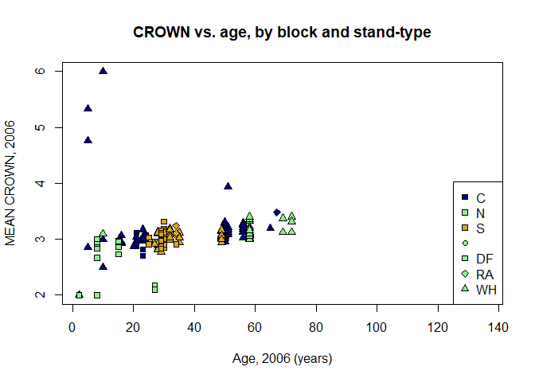

Ellsworth Resurvey Data Analysis
================

## Goals and Approach

The primary goal of these preliminary analyses is to figure out how many
plots should be resurveyed at Ellsowrth in summe, echo=TRUE,
results=“hide”r 2020. To do this, we used the pre-treatment survey
data from 2006/2007 to quantify variance in density, height, and DBH of
plots by block and stand type.

## Data Files

We used the following datafiles, which can be in the Ellsworth GitHub
repo (<https://github.com/AileneKane/ellsworth>) as well as in the
“Ellsworth Science and Monitoring” shared folder on Box.

LIVETREES\_CLEAN\_04282008.csv

PLOT\_CLEAN\_11062008.csv

Ellsworth\_stands\_treatment\_data.csv

## Analysis of pre-treatment survey data

We load the above files and packages, and then put them together into a
dataframe for analysis

There is some structure to the data, that may be important to account
for in looking at treatment effects, and therefore should be kept in
mind in resurveys: -Blocks (N,C,S), which are different geographical
regions at Ellsworth -Standtype, which are different forest types at
Ellsworth. Here is a breakdown of the number of plots in each standtype
by region:

``` r
 table(plotd2$STAND.TYP,plotd2$BLOCK)
```

    ##             
    ##               C  N  S
    ##               0  2  3
    ##   DF-1        6 21  0
    ##   DF-2        7  4 40
    ##   RA-3        1  0  4
    ##   WH/SS/RC-1 15  1  0
    ##   WH/SS/RC-2 19  0 19
    ##   WH/SS/RC-3 33  3 18
    ##   WH/SS/RC-4  0 25  0
    ##   WH/SS/RC-5  3  0  0

Now lets look at effects of age on density, height, dbh, and crown, and
quantify variation by region and stand-type using multilevel models.

## Density

``` r
plotd2$stand.code<-substr(plotd2$STAND.TYPE,1,2)
colors<-c("darkblue","lightgreen","goldenrod")
symbs<-c(21,22,23,24)
blocks<-as.character(unique(plotd2$BLOCK))
treats<-unique(plotd2$TRT)
sttypes<-sort(unique(plotd2$stand.code))

plot(plotd2$AGE_BH_2006,plotd2$predens, pch=symbs[as.numeric(as.factor(plotd2$stand.code))], bg=colors[as.numeric(as.factor(plotd2$BLOCK))], xlab="Age, 2006 (years)", ylab= "Density, 2006 (trees/plot)", main="density vs. age, by block and stand-type")

legend("topright", legend=c(blocks,sttypes),pch=c(22,22,22,symbs),pt.bg=c(colors,"lightgreen","lightgreen","lightgreen","lightgreen") )
```

<!-- -->

``` r
densmod<-lmer(predens~AGE_BH_2006 + (1|BLOCK)  + (1|STAND.TYPE), data=plotd2)
den.standsd<-VarCorr(densmod,comp="Variance")[1]
den.blocksd<-VarCorr(densmod,comp="Variance")[2]
summary(densmod)#
```

    ## Linear mixed model fit by REML ['lmerMod']
    ## Formula: predens ~ AGE_BH_2006 + (1 | BLOCK) + (1 | STAND.TYPE)
    ##    Data: plotd2
    ## 
    ## REML criterion at convergence: 1910.6
    ## 
    ## Scaled residuals: 
    ##     Min      1Q  Median      3Q     Max 
    ## -2.5567 -0.5631 -0.1083  0.5731  3.9016 
    ## 
    ## Random effects:
    ##  Groups     Name        Variance Std.Dev.
    ##  STAND.TYPE (Intercept) 500.57   22.373  
    ##  BLOCK      (Intercept)  36.66    6.055  
    ##  Residual               365.33   19.114  
    ## Number of obs: 216, groups:  STAND.TYPE, 8; BLOCK, 3
    ## 
    ## Fixed effects:
    ##             Estimate Std. Error t value
    ## (Intercept) 49.43120   11.43900   4.321
    ## AGE_BH_2006 -0.09828    0.16634  -0.591
    ## 
    ## Correlation of Fixed Effects:
    ##             (Intr)
    ## AGE_BH_2006 -0.629

There is a weak negative effect of age on density, after accounting for
variation in density and blocks. There is much higher variance in
density by stand type than by block.

## DBH

``` r
plot(plotd2$AGE_BH_2006,plotd2$dbh.mn, pch=symbs[as.numeric(as.factor(plotd2$stand.code))], bg=colors[as.numeric(as.factor(plotd2$BLOCK))], xlab="Age, 2006 (years)", ylab= "Mean DBH, 2006", main="DBH vs. age, by block and stand-type")

legend("bottomright", legend=c(blocks,sttypes),pch=c(22,22,22,symbs),pt.bg=c(colors,"lightgreen","lightgreen","lightgreen","lightgreen") )
```

<!-- -->

``` r
dbhmod<-lmer(DBH~ AGE_BH_2006+(1|BLOCK) + (1|STAND.TYPE), data=treed2)
dbh.standsd<-VarCorr(dbhmod,comp="Variance")[1]
dbh.blocksd<-VarCorr(dbhmod,comp="Variance")[2]
summary(dbhmod)#positive effect of age on dbh, similar variance by TRT and Block
```

    ## Linear mixed model fit by REML ['lmerMod']
    ## Formula: DBH ~ AGE_BH_2006 + (1 | BLOCK) + (1 | STAND.TYPE)
    ##    Data: treed2
    ## 
    ## REML criterion at convergence: 84818.7
    ## 
    ## Scaled residuals: 
    ##     Min      1Q  Median      3Q     Max 
    ## -2.5699 -0.6381 -0.1143  0.4534 15.3875 
    ## 
    ## Random effects:
    ##  Groups     Name        Variance  Std.Dev.
    ##  STAND.TYPE (Intercept)  54.12234  7.3568 
    ##  BLOCK      (Intercept)   0.03443  0.1855 
    ##  Residual               101.59504 10.0794 
    ## Number of obs: 11365, groups:  STAND.TYPE, 8; BLOCK, 3
    ## 
    ## Fixed effects:
    ##             Estimate Std. Error t value
    ## (Intercept) 14.13399    2.73878   5.161
    ## AGE_BH_2006  0.32242    0.01829  17.627
    ## 
    ## Correlation of Fixed Effects:
    ##             (Intr)
    ## AGE_BH_2006 -0.302

There is a positive age on dbh, after accounting for variation in
density and blocks. There is much higher variance in density by stand
type than by block.

## Height

``` r
plot(plotd2$AGE_BH_2006,plotd2$ht.mn, pch=symbs[as.numeric(as.factor(plotd2$stand.code))], bg=colors[as.numeric(as.factor(plotd2$BLOCK))], xlab="Age, 2006 (years)", ylab= "MEAN HEIGHT, 2006", main="HEIGHT vs. age, by block and stand-type")

legend("bottomright", legend=c(blocks,sttypes),pch=c(22,22,22,symbs),pt.bg=c(colors,"lightgreen","lightgreen","lightgreen","lightgreen") )
```

<!-- -->

``` r
htmod<-lmer(HT~ AGE_BH_2006+(1|BLOCK) + (1|STAND.TYPE), data=treed2)
summary(htmod)#positive effect of age on ht, higher variance by TRT...
```

    ## Linear mixed model fit by REML ['lmerMod']
    ## Formula: HT ~ AGE_BH_2006 + (1 | BLOCK) + (1 | STAND.TYPE)
    ##    Data: treed2
    ## 
    ## REML criterion at convergence: 14022.2
    ## 
    ## Scaled residuals: 
    ##     Min      1Q  Median      3Q     Max 
    ## -3.3668 -0.6304 -0.0418  0.5464  4.9806 
    ## 
    ## Random effects:
    ##  Groups     Name        Variance Std.Dev.
    ##  STAND.TYPE (Intercept) 21.74663 4.6633  
    ##  BLOCK      (Intercept)  0.08047 0.2837  
    ##  Residual               35.52325 5.9601  
    ## Number of obs: 2182, groups:  STAND.TYPE, 8; BLOCK, 3
    ## 
    ## Fixed effects:
    ##             Estimate Std. Error t value
    ## (Intercept) 17.48581    1.92169   9.099
    ## AGE_BH_2006  0.05838    0.02098   2.782
    ## 
    ## Correlation of Fixed Effects:
    ##             (Intr)
    ## AGE_BH_2006 -0.495

``` r
ht.standsd<-VarCorr(htmod,comp="Variance")[1]
ht.blocksd<-VarCorr(htmod,comp="Variance")[2]
```

There is a positive age on height, after accounting for variation in
density and blocks. There is much higher variance in height by stand
type than by block. \#\# Crown

``` r
plot(plotd2$AGE_BH_2006,plotd2$crown.mn, pch=symbs[as.numeric(as.factor(plotd2$stand.code))], bg=colors[as.numeric(as.factor(plotd2$BLOCK))], xlab="Age, 2006 (years)", ylab= "MEAN CROWN, 2006", main="HEIGHT vs. age, by block and stand-type")

legend("bottomright", legend=c(blocks,sttypes),pch=c(22,22,22,symbs),pt.bg=c(colors,"lightgreen","lightgreen","lightgreen","lightgreen"))
```

<!-- -->

``` r
crownmod<-lmer(CROWN~ AGE_BH_2006+(1|BLOCK) + (1|STAND.TYPE), data=treed2)

summary(crownmod)#positive effect of age on crown, lsightly higher variance in TRt than block
```

    ## Linear mixed model fit by REML ['lmerMod']
    ## Formula: CROWN ~ AGE_BH_2006 + (1 | BLOCK) + (1 | STAND.TYPE)
    ##    Data: treed2
    ## 
    ## REML criterion at convergence: 16545.3
    ## 
    ## Scaled residuals: 
    ##     Min      1Q  Median      3Q     Max 
    ## -5.6792 -0.2866 -0.0561 -0.0175  5.7064 
    ## 
    ## Random effects:
    ##  Groups     Name        Variance Std.Dev.
    ##  STAND.TYPE (Intercept) 0.16535  0.4066  
    ##  BLOCK      (Intercept) 0.01763  0.1328  
    ##  Residual               0.24948  0.4995  
    ## Number of obs: 11366, groups:  STAND.TYPE, 8; BLOCK, 3
    ## 
    ## Fixed effects:
    ##             Estimate Std. Error t value
    ## (Intercept) 2.859453   0.168422  16.978
    ## AGE_BH_2006 0.006614   0.000916   7.221
    ## 
    ## Correlation of Fixed Effects:
    ##             (Intr)
    ## AGE_BH_2006 -0.246

``` r
crown.standsd<-VarCorr(crownmod,comp="Variance")[1]
crown.blocksd<-VarCorr(crownmod,comp="Variance")[2]
```

There is a positive age on crown, after accounting for variation in
density and blocks. There is much higher variance in crown by stand type
than by block.
